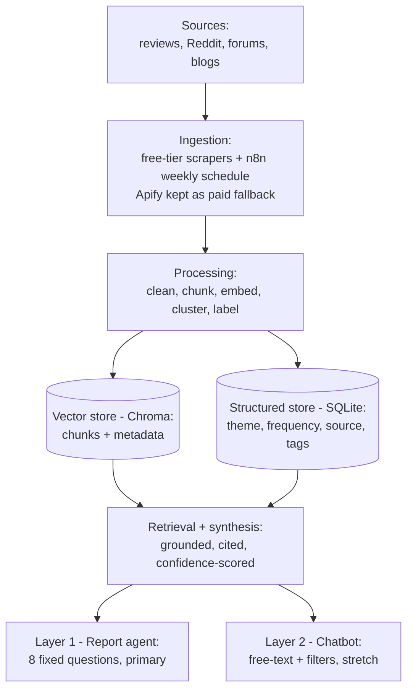
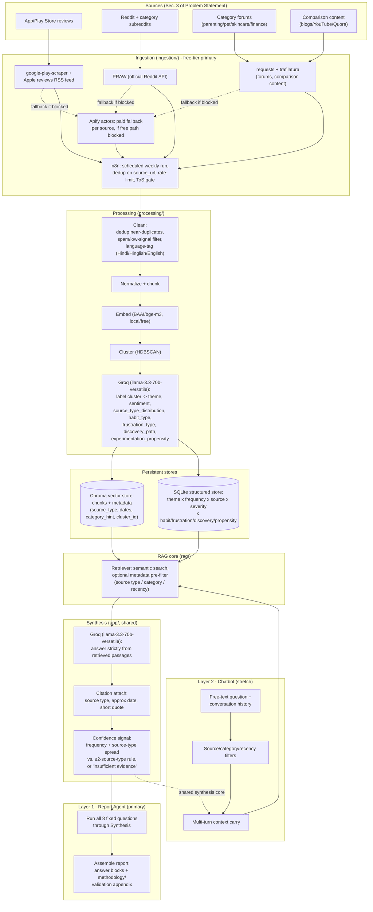

# Architecture — Blinkit Category Cross-Sell RAG System (Merged v2)

Backbone: RAG pipeline architecture (cost-sublinear, cluster-based synthesis).
Grafted in: richer PM-facing tagging taxonomy and explicit data-cleaning step from the alternative design.
This document is the detailed system design; CLAUDE.md remains the source of truth for constraints — if they ever disagree, CLAUDE.md wins and this file should be updated.

## 1. Design Principles (drive every decision below)

- **Groundedness over fluency** — synthesis only asserts what retrieved passages support.
- **Cross-source triangulation** — a theme is "high confidence" only once it appears in ≥2 source types; single-source themes are labeled as such, never silently upgraded.
- **Sparsity is a finding** — insufficient evidence is a valid, expected output, not an error state.
- **One backend, two packagings** — Layer 1 (Report Agent) and Layer 2 (Chatbot) share ingestion, embedding, clustering, retrieval, and synthesis. Nothing is layer-specific below the "Answer Assembly" stage.
- **Auditability** — every claim is click-through-able to a raw source document.
- **Cost scales sub-linearly with corpus growth** — batch, not streaming; cluster once, re-embed incrementally; **the LLM never reads the raw corpus record-by-record** — it reads cluster representatives only.
- **Tagging depth without cost blowup** — richer PM-facing dimensions (habit type, frustration type, discovery path, experimentation propensity) are captured at the *cluster* level, not the per-record level, so taxonomy richness doesn't reintroduce linear LLM cost.

## 2. System Overview

### 2.1 High-Level Flow



**Sources** (Sec. 3 of Problem Statement)
→ App/Play Store reviews · Reddit + category subreddits · Category forums · Comparison content (blogs/YouTube/Quora)

**Ingestion** (`ingestion/`)
→ Free-tier, primary: `google-play-scraper` · Apple reviews RSS feed · official Reddit API (PRAW) · `requests`+`trafilatura` for forums/comparison URLs · Apify actors kept as a paid fallback per source · n8n scheduled runs, dedup, rate-limit, ToS compliance

**Processing** (`processing/`)
→ Clean (dedup, spam/low-signal filtering, language tagging) → Normalize + chunk → Embed (`BAAI/bge-m3`, free/local/multilingual) → Cluster (HDBSCAN) → Groq (`llama-3.3-70b-versatile`) labels cluster: **theme, sentiment, habit type, frustration type, discovery path, experimentation propensity** → structured JSON

**RAG core** (`rag/`)
→ Chroma vector store (chunks + metadata) · Structured store (SQLite): theme × frequency × source × severity × habit/frustration/discovery/propensity tags · Retriever: hybrid filter + semantic search per question

**Synthesis** (shared, `app/`)
→ Groq (`llama-3.3-70b-versatile`) answers strictly from retrieved passages → Citation attach (source type, approx date, short quote) → Confidence signal (count + source-type spread, or "insufficient evidence")

**Layer 1 — Report Agent (primary)**
→ Runs fixed 8 questions → Assembles structured report + methodology/validation appendix

**Layer 2 — Chatbot (stretch)**
→ Free-text question + conversation history → Source/category/recency filters → Multi-turn context carry

**Web frontend (`app/web_app.py`)**
→ One Streamlit app, two tabs over the *same* online query path: a Chat tab wrapping Layer 2's `ChatSession`, and a Report tab that *renders* the already-validated `docs/INSIGHT_REPORT.md` (it does not regenerate per visitor). Hosted free on Streamlit Community Cloud; query embedding is served by Cloudflare Workers AI's bge-m3 (same model, no in-process 2.3GB load); the committed corpus travels with the repo.

### 2.2 Detailed Component Flow

The diagram above collapses each stage to one box. This is the same flow expanded to the
sub-steps that Sec. 3 describes in prose, so the two stay traceable to each other node-for-node.



### 2.3 Offline Pipeline vs. Online Query Path

The system has exactly two runtime paths, and everything below "Answer Assembly" (Design
Principle 4) is identical for both layers:

- **Offline / batch path** (Sources → Ingestion → Processing → Stores): runs on the n8n
  weekly schedule. Nothing here is question-aware — it produces the vector store and
  structured store once per refresh, regardless of what anyone later asks. This is where
  cost sub-linearity is enforced: the LLM only ever reads cluster representatives here
  (Design Principle 6), never the full corpus, and never again per-question.
- **Online / query path** (Stores → Retriever → Synthesis → Answer): runs per question,
  against whatever the last offline refresh produced. This path is the single shared core
  — Layer 1 calls it 8 times in one batch job (fixed questions, no user in the loop);
  Layer 2 calls it once per chat turn (free-text, with filters and prior-turn context
  folded into the retrieval query). Latency and grounding rules (Sec. 3.4, 5) apply
  identically regardless of which layer invoked it.

Concretely: a corpus refresh does not require re-running any report or reopening the
chatbot, and asking a question does not touch ingestion/processing at all — the two paths
only meet at the vector/structured stores.

## 3. Component Breakdown

### 3.1 Ingestion (`ingestion/`)

Each source has a free-tier primary path and a paid Apify fallback, selected by which
orchestrator script runs (`run_ingestion.py` vs. `run_ingestion_apify_fallback.py`) —
not a per-call decision, so a run is unambiguously one or the other.

| Concern | Primary (free) | Fallback (paid) | Why |
|---|---|---|---|
| Play Store reviews | `google-play-scraper` | Apify `neatrat/google-play-store-reviews-scraper` | Free path scrapes Google's public review pages directly, no key |
| App Store reviews | Apple's public reviews RSS feed | Apify `thewolves/appstore-reviews-scraper` | Free path currently unreliable on Apple's side (verified empty across multiple apps, not Blinkit-specific) — fallback hits the same wall via a different technique |
| Reddit | Official Reddit API (PRAW), free "script" app | Apify `harshmaur/reddit-scraper` | Free path is more ToS-compliant (goes through Reddit's own OAuth API rather than an unofficial scraper) |
| Forums / comparison content | `requests` + `trafilatura` | Apify `apify/website-content-crawler` | Free path fetches a small, hand-picked URL list directly; fallback adds recursive crawling and heavier anti-bot handling if ever needed |
| Scheduling / orchestration | n8n | n8n | Batch, not streaming (non-goal); one repeatable weekly workflow, same for either ingestion path |
| Compliance | Enforced per-scraper (rate limiting, public-data-only) | Enforced in n8n workflow | No authenticated/paywalled/private scraping; respects platform ToS per source (non-negotiable) |

Each ingested document carries: `source_type`, `source_url`, `captured_at`, `approx_content_date`, `category_hint` (if derivable from the search query), `raw text` — identical shape regardless of which path produced it, so nothing downstream needs to know which one ran.

### 3.2 Processing (`processing/`)

**Clean** *(new — grafted from the alternative design's ETL step)*
- Deduplicate near-identical records (common with scraped reviews/reposts).
- Filter spam and extremely short / non-informative text before it reaches embedding — this is cheap to do pre-embed and keeps clusters from being diluted by noise.
- Language-tag each record (Hindi / Hinglish / English) for downstream filtering — **tagging only, no translation** (translation stays out of scope per Non-Goals; Hinglish/code-switched text is preserved as-is).

**Normalize + chunk** — strip boilerplate, chunk to retrieval-friendly size.

**Embed** — `BAAI/bge-m3` embeddings for all chunks. Free, local, multilingual (handles Hinglish/code-switched text without a separate translation step), run via `sentence-transformers` — no API key or per-call cost.

**Cluster** — HDBSCAN over embeddings. Chosen over pure LLM-over-raw-corpus reads because that approach is inconsistent and expensive at scale; clustering first bounds how much text the LLM has to read per theme.

**Label clusters** — Groq (`llama-3.3-70b-versatile`) reads representative chunks per cluster and emits structured JSON:
- `theme`, `sentiment`, `source_type_distribution`, `example_quotes`, `frequency` *(original)*
- `habit_type` — repetitive vs. exploratory purchase pattern *(grafted)*
- `frustration_type` — delivery, pricing, discovery, information, trust, etc. *(grafted)*
- `discovery_path` — search, homepage banner, offers, external recommendation *(grafted)*
- `experimentation_propensity` — high / medium / low *(grafted)*

This is still the *only* LLM pass over raw text at ingestion time — the added tags ride along in the same structured-output call, so the taxonomy gets richer without adding a second LLM pass or reintroducing per-record cost.

**Structured store** — SQLite table: theme × frequency × source × severity × habit/frustration/discovery/propensity, separate from the vector store, used for the confidence/frequency signal and for audit ("seen across 40+ reviews and 6 Reddit threads" vs. "mentioned once").

Re-running processing on a growing corpus re-clusters incrementally (new docs assigned to existing clusters where they fit, new clusters formed only when warranted) — full re-clustering from scratch every week is the fallback if incremental assignment proves unreliable, not the default.

### 3.3 RAG core (`rag/`)

- **Vector store**: Chroma only — free, self-hosted, sufficient for this project's scale. No managed vector DB is planned; the retrieval client still sits behind one interface for hygiene, but there is no second backend queued up behind it.
- **Metadata per chunk**: `source_type`, `approx_date`, `category_hint`, `cluster_id`, `source_url` — enables Layer 2's filter-by-source/category/recency requirement without a second index.
- **Retrieval**: semantic search scoped to the query, optionally pre-filtered by metadata when the caller specifies it. Retrieval precision@k target ≥80%.

### 3.4 Synthesis (shared, lives under `app/`)

Single synthesis prompt/module used by both layers:
- Input: a question + retrieved passages (+ prior turns, for Layer 2).
- Groq (`llama-3.3-70b-versatile`) answers only from retrieved passages — no answer may assert something the context doesn't support (non-negotiable).
- Every claim gets a citation: source type, approximate date, short quote.
- Confidence signal attached per theme/claim, pulled from the structured store's frequency/source-type-spread data — cross-referenced against the ≥2-source-type rule for "high confidence."
- If retrieval + structured store can't clear the evidence threshold for a question, return insufficient evidence explicitly rather than a synthesized answer. (Exact threshold is an open question — see Sec. 6.)
- Answers can now also surface the richer tags where relevant to a question — e.g. a question about "why don't users explore new categories" can pull `habit_type` and `experimentation_propensity` distributions directly from the structured store, rather than requiring the LLM to re-derive that framing from raw text each time.

### 3.5 Layer 1 — Report Agent (`app/`, primary deliverable)

- Runs the shared retrieval+synthesis pipeline against the 8 fixed questions (Problem Statement Sec. 6).
- Assembles one structured document: per-question answer blocks + a methodology/validation appendix.
- Re-runnable on a schedule (weekly, matching corpus refresh) without manual re-authoring — it's a pipeline run, not a hand-edited document.

### 3.6 Layer 2 — Chatbot (`app/`, stretch)

- Thin conversational wrapper: free-text question → same retrieval+synthesis core.
- Adds: source-type/category/recency filters, multi-turn context, Hinglish input handling (already required at the corpus level, so no separate translation layer needed).
- Explicitly not required to be production-hardened (Non-Goals) — prototype-quality is the bar.
- Can be cut entirely without reworking Layer 1, since it adds no new backend components.

### 3.7 Web frontend (`app/web_app.py`)

A single **Streamlit** app is the public-web packaging of both deliverables, so
neither the report nor the chatbot requires a terminal to use. It adds a UI only —
it reuses the identical retriever + synthesis modules the terminal entry points
call, not a fork.

- **Chat tab** — wraps Layer 2's `ChatSession` (Sec. 3.6). Same per-turn retrieval,
  query expansion, single synthesis call, filters (source type / recency), and
  citation/confidence/insufficient-evidence rendering.
- **Report tab** — *renders* the already-generated `docs/INSIGHT_REPORT.md`. It does
  **not** regenerate the report per visitor: regeneration stays on the Phase 8
  refresh schedule (`report_agent.py` → `validate.py`), so no page-load ever burns
  Groq quota or serves an unvalidated report. The web layer is a read-only window
  onto whatever the last validated refresh produced.
- **Query embedding (hosted, not in-process)** — the web host does **not** load the
  ~2.3GB `bge-m3` model. Instead `rag/vector_store.py` `embed_query()` calls **Cloudflare
  Workers AI `@cf/baai/bge-m3`** — the *same* model, over a free, no-card HTTP API —
  whenever `CF_ACCOUNT_ID`+`CF_API_TOKEN` are set (read at call time), falling back to the
  local model otherwise. This keeps the app small enough for a lightweight free host. The
  `sentence-transformers` import is lazy so it's never pulled in on the API path. Vector
  consistency verified: Cloudflare vs local cosine = 1.0000 (`rag/test_cloudflare_embed.py`),
  so the existing corpus is reused unchanged.
- **Hosting** — Streamlit Community Cloud (free; deploys from a GitHub repo). The committed
  corpus (`rag/chroma_data` + `processing/insights.db`, ~11MB) travels in the repo, so the
  app serves answers without ever running ingestion or embedding the corpus. `GROQ_API_KEY`,
  `CF_ACCOUNT_ID`, and `CF_API_TOKEN` live in the host's encrypted secrets, never committed.
  *(Hugging Face Spaces was the first host but its account-level free `cpu-basic` quota was
  exhausted, and HF doesn't accept Indian cards to lift it — which is what drove the move to
  a lighter app + Cloudflare embedding + Streamlit Cloud.)*
- **Deploy dependencies** — a strict subset (`requirements-web.txt`): serve-time packages
  only (`streamlit`, `groq`, `chromadb`, `python-dotenv`, `requests`) — no
  `sentence-transformers`/torch, and none of the ingestion/processing stack.
- **Freshness** — after a Phase 8 refresh passes validation, the pipeline pushes the
  updated report + corpus to the GitHub repo; Streamlit Cloud auto-redeploys on push, so the
  live site tracks the latest validated corpus without a manual redeploy.

This layer, like Layer 2, is prototype-quality by design (Non-Goals) and can be cut
without touching any backend component.

## 4. Data Model

**Vector store (Chroma)** — per chunk
```
id, text, embedding,
source_type, source_url, captured_at, approx_content_date,
category_hint, cluster_id
```

**Structured store (SQLite) — theme table** *(expanded)*
```
theme_id, theme_label, sentiment,
source_type, frequency_count, severity,
habit_type, frustration_type, discovery_path, experimentation_propensity,
example_quote_ids, first_seen_date, last_seen_date
```

**Example quotes table**
```
quote_id, chunk_id (-> vector store), theme_id,
source_type, source_url, approx_date, quote_text
```

This split exists so the confidence/frequency signal, the PM-facing tags, and the audit trail don't depend on re-querying the vector store at report-generation time — the structured store is the fast path for "how many, from where, what kind."

## 5. Cross-Cutting Concerns

| Requirement | Mechanism |
|---|---|
| Groundedness ≥95% | Synthesis prompt restricted to retrieved context only; manual audit sample checks claim → citation traceability |
| Retrieval precision@k ≥80% | Metadata-filtered semantic search; tuned per question type |
| Cross-source coverage ≥70% for high-confidence themes | Structured store's `source_type` distribution per theme checked before labeling "high confidence" |
| Hallucination rate <5% | Manual audit against citations; same audit as groundedness check |
| Data cleanliness | Dedup + spam/low-signal filtering before embedding (Sec. 3.2) — keeps clusters from being diluted by noise before it ever reaches the LLM |
| Tagging consistency | Habit/frustration/discovery/propensity tags spot-checked against source text during the same manual audit pass — one QA pass covers both groundedness and taxonomy accuracy |
| Corpus freshness (weekly) | n8n scheduled ingestion run |
| Answer latency <15s (Layer 2) | Chroma local retrieval + single Groq synthesis call; no multi-hop agentic loop unless a question demands it |
| Cost sub-linear with corpus growth | Clustering bounds LLM reads to cluster representatives, not full corpus; incremental re-clustering avoids full reprocessing; richer tagging rides the same single per-cluster call, not an added pass |
| Auditability | Every chunk and quote traces back to `source_url` + `captured_at` |
| ToS compliance | Enforced in ingestion (n8n), not left to processing/synthesis |
| Free web hosting | Streamlit Community Cloud (free, from a GitHub repo); query embedding via Cloudflare Workers AI bge-m3 (no in-process 2.3GB model); corpus committed to repo (~11MB); serve-only deps in `requirements-web.txt` |
| Secret hygiene (web) | `GROQ_API_KEY`, `CF_ACCOUNT_ID`, `CF_API_TOKEN` in the host's encrypted secrets, never committed — same rule as local `.env` |
| PII protection | `processing/scrubber.py` redacts emails / phones / PAN / long-id numbers / URL tokens in the clean stage — before embedding, LLM, report, and citations; financial amounts kept as signal. Raw text stays only in the gitignored raw cache. *(adopted from the Groww review-pulse architecture)* |
| Prompt-injection defense | Synthesis wraps retrieved passages as fenced UNTRUSTED data and instructs the model to ignore any instructions inside them (or in prior turns); grounding rules unchanged. *(adopted from the Groww review-pulse architecture)* |

## 6. Open Questions (carried from Problem Statement Sec. 10 — not yet decided)

- Exact refresh cadence vs. cost tradeoff (default assumption above: weekly).
- Whether confidence is exposed numerically or only as qualitative language.
- How to discount Reddit sarcasm/exaggeration in frequency counts.
- Minimum evidence threshold for "insufficient evidence" (currently pipeline-enforced but not numerically pinned down).
- Chatbot query access model, if Layer 2 is built.
- Whether the report is one-time (grading) or scheduled/re-runnable from day one — current design assumes re-runnable, since it costs nothing extra to build it that way.
- **New**: Should `habit_type` / `frustration_type` / `discovery_path` / `experimentation_propensity` use a fixed enum (as listed in Sec. 3.2) or an open-ended label the LLM proposes per cluster? Fixed enums are easier to aggregate into dashboards; open labels catch categories the enum didn't anticipate. Currently assumed fixed enum, revisit if early clusters don't fit cleanly.

These are flagged, not silently resolved — decisions here should be proposed as options and confirmed before implementation, not assumed.

## 7. Presentation Note (for the diagram / fellowship writeup)

Frame the pipeline with verbs, tied explicitly to the discovery questions in the brief (habits, exploration blockers, discovery paths, frustrations, unmet needs):

**Collect** (free-tier scrapers, Apify as paid fallback, + n8n) → **Clean** (dedup, spam filter, language tag) → **Cluster & Classify** (HDBSCAN + Groq structured labeling, incl. habit/frustration/discovery/propensity tags) → **Store** (Chroma + SQLite) → **Retrieve** (hybrid filtered semantic search) → **Explain** (grounded synthesis with citations + confidence signal).

Left column: data sources. Middle column: free-tier scrapers (Apify fallback) → clean/cluster/classify → Chroma + SQLite. Right column: Report Agent (primary) + Chatbot (stretch), both surfaced through one free-hosted Streamlit web app (Hugging Face Spaces) for PM consumption — no terminal required.
