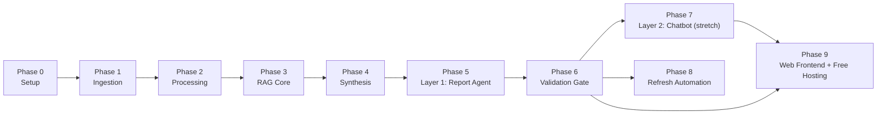

# Phase-Wise Implementation Plan — Blinkit Category Cross-Sell RAG System

Derived from `docs/PROBLEM_STATEMENT.md` (scope, metrics, success criteria),
`docs/ARCHITECTURE.md` (component design), and `CLAUDE.md` (decided architecture,
non-negotiables, working conventions). Build order follows the data flow: nothing in a
later phase can be validated until every phase before it is real and re-runnable.

**Sequencing rule (from `CLAUDE.md`):** Layer 1 (Report Agent) is the graded deliverable
and must be built and validated first. Layer 2 (Chatbot) is stretch — it is the *last*
phase, and the plan must stay complete and shippable without it.

---

## Phase Dependency Overview

Phase 7 depends on Phase 6 passing, not just Phase 5 finishing — a report that isn't
grounded shouldn't be exposed via chat either. Phase 8 (scheduled re-runs) can start
in parallel with Phase 7 once Phase 6 passes, since it only touches ingestion/processing.
Phase 9 (web frontend) needs Phase 6 (a validated report to display) and Phase 7 (the
`ChatSession` it wraps); it adds a UI only and no new backend, so it comes last.

---

## Phase 0 — Project Setup

**Goal:** working environment, no functional code yet.

- Create `.env` from `.env.example`; populate `GROQ_API_KEY`, `REDDIT_CLIENT_ID`,
  `REDDIT_CLIENT_SECRET`, `CHROMA_PERSIST_DIR`, `SQLITE_DB_PATH`. `APIFY_TOKEN` is
  optional — only needed for the paid Apify fallback path. (`bge-m3` embeddings and
  the Play/App Store/web-crawl scrapers all run locally — no key.)
- Install `requirements.txt` (groq, chromadb, sentence-transformers, google-play-scraper,
  praw, trafilatura, requests, pandas, scikit-learn, hdbscan, python-dotenv,
  apify-client for the fallback path).
- Register a free Reddit "script" app at reddit.com/prefs/apps for `REDDIT_CLIENT_ID`/
  `REDDIT_CLIENT_SECRET` (read-only access to public data, no username/password needed).
- Stand up n8n (local or hosted) for later orchestration — not wired to anything yet.

**Exit criteria:** a script can call the Groq API, write/read a local Chroma collection,
and reach at least one free-tier ingestion source, each in isolation. (Apify actor
check is optional, fallback-path only.)

---

## Phase 1 — Ingestion (`ingestion/`)

**Goal:** raw documents from every in-scope source, landing in a common shape.

| Task | Detail |
|---|---|
| Play Store scraper | `google-play-scraper` (free); category-first via client-side keyword filtering on fetched reviews, not brand-first bulk pulls |
| App Store scraper | Apple's public reviews RSS feed (free); no keyword filter available, volume capped instead — currently unreliable on Apple's side (verified empty across multiple apps), not a Blinkit-specific gap |
| Reddit scraper | Official Reddit API via PRAW (free "script" app), targeted at category subreddits + keyword search across Reddit, not just brand mentions |
| Forums / comparison content | `requests` + `trafilatura` against a small, hand-picked list of real forum/comparison URLs (parenting/pet/skincare/finance-adjacent) |
| Apify fallback | Same four sources via Apify actors (`ingestion/*_apify.py`, run via `run_ingestion_apify_fallback.py`), kept in reserve per source if the free path breaks |
| Common document shape | Every ingested item gets: `source_type`, `source_url`, `captured_at`, `approx_content_date`, `category_hint`, raw text — identical shape regardless of which path produced it |
| ToS compliance | No authenticated/paywalled/private scraping — enforce per-source at this layer, not downstream (`CLAUDE.md` non-negotiable); free-tier scrapers add their own rate-limiting/politeness delays |
| n8n workflow | Wraps the above as one scheduled, re-runnable job (dedup on `source_url`, rate-limiting per source) |

**Cost gate (`CLAUDE.md` working convention):** applies only to the Apify fallback path
— confirm actor run cost with the user before any fallback scrape expected to exceed a
couple of dollars. The free-tier path has no per-use cost to confirm.

**Exit criteria:** a scheduled n8n run produces deduplicated raw documents, tagged with
`source_type`, for all four source categories in the scope list.

---

## Phase 2 — Processing (`processing/`)

**Goal:** raw documents → cleaned, clustered, richly-labeled themes + a queryable structured store.

1. **Clean** — deduplicate near-identical records; filter spam and extremely short /
   non-informative text before it reaches embedding; language-tag each record (Hindi /
   Hinglish / English) for downstream filtering — tagging only, no translation
   (translation stays out of scope per Non-Goals).
2. **Normalize + chunk** — strip boilerplate; chunk to retrieval-friendly size; preserve
   Hinglish/code-switched text as-is.
3. **Embed** — `BAAI/bge-m3` embeddings for every chunk (free, local, multilingual via
   `sentence-transformers` — no API key; first run downloads the model, ~2.3GB).
4. **Cluster** — HDBSCAN over embeddings.
5. **Label clusters** — Groq (`llama-3.3-70b-versatile`) reads cluster-representative
   chunks only (not the full raw corpus — that's inconsistent and expensive at scale,
   per `CLAUDE.md`) and emits
   structured JSON: `theme`, `sentiment`, `source_type_distribution`, `example_quotes`,
   `frequency`, plus the richer PM-facing tags — `habit_type` (repetitive vs. exploratory
   purchase pattern), `frustration_type` (delivery, pricing, discovery, information, trust,
   etc.), `discovery_path` (search, homepage banner, offers, external recommendation),
   `experimentation_propensity` (high / medium / low). These ride along in the same
   structured-output call as the original tags — no second LLM pass, no per-record cost.
6. **Structured store** — SQLite table: `theme x frequency x source x severity x
   habit_type x frustration_type x discovery_path x experimentation_propensity`, separate
   from the vector store.

**Quality check for this phase:** manually spot-check a sample of cluster labels —
including the new habit/frustration/discovery/propensity tags, not just theme/sentiment —
for precision before treating them as ground truth (`CLAUDE.md` working convention) — this
is a cheap check now and an expensive bug to find later, since Layer 1's confidence signals
depend on this table being right.

**Exit criteria:** every ingested chunk is cleaned (deduped, spam-filtered, language-tagged),
has an embedding and a cluster assignment; every cluster has a Groq-labeled theme/sentiment
+ habit/frustration/discovery/propensity row in the structured store, spot-checked.

---

## Phase 3 — RAG Core (`rag/`)

**Goal:** retrieval that returns relevant, filterable passages per question.

- Load embedded chunks into Chroma with metadata: `source_type`, `approx_date`,
  `category_hint`, `cluster_id`, `source_url`.
- Build the retriever: semantic search per query, with optional metadata pre-filter
  (source type / category / recency) — the same interface Layer 1's fixed questions and
  Layer 2's chat filters will both call.
- Isolate the vector-store client behind one interface for hygiene — Chroma is the
  only vector store planned, no managed-DB swap is queued up behind it.

**Exit criteria:** retrieval precision@k ≥80% on a hand-labeled sample of queries drawn
from the 8 seed questions (Problem Statement Sec. 4 metric).

---

## Phase 4 — Shared Synthesis Engine (`app/`, shared)

**Goal:** one grounded-answer module both layers call — this is the trust-critical core.

- Input: question + retrieved passages (+ prior turns, for later Layer 2 use).
- Groq (`llama-3.3-70b-versatile`) answers **only** from retrieved passages; no claim beyond what's cited.
- Every claim gets a citation: source type, approximate date, short quote.
- Confidence signal per theme, pulled from the Phase 2 structured store: frequency count
  + source-type spread, checked against the ≥2-source-type rule for "high confidence."
- Explicit **insufficient evidence** response path when retrieval + structured store can't
  clear the evidence bar for a question — this must be a first-class output, not a
  fallback error.
- Where relevant to a question, answers can pull the richer `habit_type` /
  `frustration_type` / `discovery_path` / `experimentation_propensity` distributions
  directly from the structured store (e.g. "why don't users explore new categories")
  instead of requiring the LLM to re-derive that framing from raw text each time.

**Approval gate (`CLAUDE.md` working convention):** changes to the synthesis prompt's
grounding rules need sign-off before implementation — this is one of the trust-critical
parts of the system.

**Exit criteria:** given a known-answerable question and a known-unanswerable one, the
engine produces a cited answer for the first and an explicit insufficient-evidence
response for the second.

---

## Phase 5 — Layer 1: Report Agent (`app/`, primary deliverable)

**Goal:** the graded artifact — one structured report, all 8 questions answered.

- Run the Phase 4 engine against each of the 8 fixed questions (Problem Statement Sec. 6).
- Assemble one document: per-question answer blocks (citations + confidence signal
  inline) plus a methodology/validation appendix covering data gathering, theme
  identification, and validation approach.
- Make the run re-runnable on demand (and later, on the Phase 8 schedule) without manual
  re-authoring of the document structure.

**Exit criteria:** report completeness 8/8 (Problem Statement Sec. 4 metric) — every
question has a cited answer or an explicit insufficient-evidence statement.

---

## Phase 6 — Validation Gate (required before Layer 1 is "done")

**Goal:** prove the report meets the evidence-quality bar, not just that it renders.

| Check | Target | Method |
|---|---|---|
| Groundedness rate | ≥95% of claims traceable to a cited source | Manual audit of a held-out claim sample |
| Hallucination rate | <5% unsupported-claim rate | Same audit pass as groundedness |
| Cross-source coverage | ≥70% of "high-confidence" themes cite ≥2 source types | Check structured store's `source_type_distribution` per theme |
| Hypothesis check | ≥2 of the Part 1 root-cause hypotheses supported or contradicted by real evidence | Manual review of report output against Part 1 hypotheses list |

This phase gates Phase 7: a report that fails groundedness/hallucination targets should
not be exposed as a live chat surface, since that multiplies the number of unaudited
answers rather than fixing the underlying retrieval/synthesis issue.

**Exit criteria:** all four checks above pass on the current corpus. This is the
Problem Statement's Layer 1 Definition of Done (Sec. 9).

---

## Phase 7 — Layer 2: Chatbot (stretch, only after Phase 6 passes)

**Goal:** thin conversational wrapper over the same backend — no new retrieval/synthesis.

- Free-text question in → Phase 4 engine, same citation/confidence standard as the report.
- Add: source-type/category/recency filters; multi-turn context (prior turn feeds
  retrieval query expansion); Hinglish input handling (already required at the corpus
  level — no separate translation layer).
- Target <15s answer latency; qualitative pass on follow-up coherence.
- Prototype-quality is sufficient — this layer is explicitly not required to be
  production-hardened.

**Cut condition:** if time runs short, cut this phase entirely rather than compromising
Phase 5/6 — it adds no new backend components, so cutting it costs nothing structurally.

**Exit criteria (only evaluated if attempted):** answers the 8 seed questions plus ≥3
novel follow-ups correctly, with citations and coherent multi-turn context.

---

## Phase 8 — Refresh Automation (can run parallel to Phase 7)

**Goal:** the corpus and report stay current without manual re-authoring.

- Wire the Phase 1 n8n ingestion workflow to a weekly schedule (default cadence pending
  the open cost-vs-freshness question).
- Extend Phase 2 clustering to assign new documents to existing clusters incrementally;
  fall back to full re-clustering only if incremental assignment proves unreliable.
- Re-run Phase 5's report generation on the refreshed corpus and confirm Phase 6 checks
  still pass — a schedule that silently degrades groundedness is worse than no schedule.

**Exit criteria:** a second scheduled run, on a corpus that has grown since Phase 6,
still clears the Phase 6 validation targets.

**Scheduler (decided):** **Windows Task Scheduler** (not n8n) runs the pipeline weekly —
simpler for a solo Windows setup and satisfies the "scheduled run" exit criterion
identically. `scripts/run_refresh.ps1` wraps `refresh.py` with timestamped logging to
`logs/`; the task `BlinkitRAGWeeklyRefresh` fires Sundays 03:00. An on-demand **"Refresh
Now" button** (`Refresh Now.bat` + a Desktop shortcut, plus `Refresh Now (no scraping).bat`
for `--skip-ingest`) runs the same wrapper, so a manual refresh and the weekly one are the
identical action. The refresh must run on the user's machine (it needs the local model +
ingestion stack), so it cannot be a button inside the Streamlit-Cloud web app. `refresh.py` itself is
the end-to-end pipeline (ingest → process → load Chroma → report → validate → optional
Google Doc), with incremental embedding (`run_processing.py`) so cost scales with new
data. Note: this refresh uses the LOCAL bge-m3 model (runs on the user's machine); the
Cloudflare embedding path from Phase 9 is web-serving only and doesn't touch this.

**Cloud scheduler option (adopted from the Groww architecture):** `.github/workflows/
weekly-refresh.yml` runs the same pipeline on GitHub Actions — fires even when the PC is
off, and commits the refreshed corpus + report back to the repo (which auto-redeploys the
Streamlit Cloud app). Weekly cron (Mon 03:00 IST) + a manual "Run workflow" button
(`workflow_dispatch`, with a `skip_ingest` toggle). Prerequisites: the repo on GitHub with
the corpus tracked (Phase 9 migration), and Actions secrets `GROQ_API_KEY`,
`REDDIT_CLIENT_ID`, `REDDIT_CLIENT_SECRET` (optional `SYNTHESIS_MODEL`, `APIFY_TOKEN`).
Windows Task Scheduler stays as the reliable local path (home IP + creds); GitHub Actions
is the PC-off cloud path. Untested until the GitHub repo exists.

**Status: COMPLETE.** A manual `refresh.py --skip-ingest` run (8B model) reprocessed the
corpus end-to-end and ended in `VALIDATION GATE: PASS` (6/8 answered, 2/8 insufficient,
groundedness/hallucination gates passed) — closing the exit criterion. That run also
scrubbed the corpus via the new PII scrubber (raw emails → 0; `[PHONE]`/`[ID]` markers
present) and the scrubbed corpus + report were pushed to GitHub. Scheduler surfaces all
built: Windows Task `BlinkitRAGWeeklyRefresh` (Ready, Sun 03:00), the on-demand "Refresh
Now" button, and the GitHub Actions workflow (repo now exists; secrets GROQ/CF/APIFY set,
Reddit creds still needed for a full cloud scrape).

---

## Phase 9 — Web Frontend + Free Hosting (`app/web_app.py`)

**Goal:** put both deliverables on the public web, free of cost, without a terminal —
one Streamlit app over the *same* backend (no new retrieval or synthesis).

**Host decision (revised — see history below):** deployed on **Streamlit Community
Cloud** (free, deploys from a GitHub repo). Query embedding is served by **Cloudflare
Workers AI `@cf/baai/bge-m3`** — the *same* model the corpus was built with, over a free,
no-card HTTP API — so the web host never loads the ~2.3GB model and stays within a small
free RAM footprint. Verified consistent: Cloudflare vs local bge-m3 cosine = 1.0000 on
sample + Hinglish probes (`rag/test_cloudflare_embed.py`), so the existing corpus is kept
as-is and only queries are routed through Cloudflare.

**Host history (why not the earlier choices):**
- *Netlify / Firebase* — static/serverless, can't hold a model in memory; Firebase's free
  Spark plan also blocks outbound calls to non-Google APIs (Groq). Rejected.
- *Hugging Face Spaces* — first attempt. Code + corpus were pushed and it ran, but the
  free `cpu-basic` **compute quota is account-level and was exhausted**, and HF **does not
  accept Indian credit cards** to lift it — so it can't be relaunched for weeks. Abandoned.
- The quota wall is what forced the embedding re-architecture: making the app light enough
  for a smaller free host (Streamlit Cloud) meant removing the 2.3GB in-process model,
  which Cloudflare's hosted bge-m3 does without changing the model or the vectors.

| Task | Detail |
|---|---|
| Streamlit app | `app/web_app.py`: Chat tab wraps Layer 2's `ChatSession`; Report tab renders `docs/INSIGHT_REPORT.md` |
| No per-visitor regeneration | Report tab *displays* the file; regeneration stays on the Phase 8 schedule so no page-load burns Groq quota or serves an unvalidated report |
| API embedding | `rag/vector_store.py` `embed_query()` calls Cloudflare bge-m3 when `CF_ACCOUNT_ID`+`CF_API_TOKEN` are set (read at call time), else the local model. `sentence-transformers` import is lazy, so the web host never pulls torch. |
| Serve-only deps | `requirements-web.txt`: `streamlit`, `groq`, `chromadb`, `python-dotenv`, `requests` — no `sentence-transformers`/torch (that's the point), and none of the ingestion/processing stack |
| Corpus in repo | The committed corpus (`rag/chroma_data` + `processing/insights.db`, ~11MB) travels with the repo, so the host serves without ever ingesting or embedding the corpus |
| Secret hygiene | `GROQ_API_KEY`, `CF_ACCOUNT_ID`, `CF_API_TOKEN` go in the host's encrypted secrets, never committed — same rule as the local `.env` |
| Freshness hook | After a Phase 8 refresh clears validation, push the updated report + corpus to the GitHub repo; Streamlit Cloud auto-redeploys on push |

**Cut condition:** like Layer 2, this is prototype-quality by design (Non-Goals) and can
be cut without touching any backend component.

**Exit criteria:** the app is reachable on a public URL; the Chat tab answers the 8 seed
questions with citations/confidence/insufficient-evidence identical to the terminal
chatbot, and the Report tab shows the current validated `INSIGHT_REPORT.md`.

**Status:** re-architecture complete and verified locally — Cloudflare embedding matches
local (cosine 1.0), full chat turn works end-to-end via Cloudflare + Groq (backend =
Cloudflare, no local model loaded, ~3.5s, cited high-confidence answer). Remaining: push
to a GitHub repo and connect Streamlit Community Cloud with the three secrets.

### Phase 9b — Google Docs report publishing (optional companion)

**Goal:** publish the validated report as a native Google Doc on every refresh, free,
with a stable shareable link — a second consumption surface alongside the web Report tab.

**Auth model (decided):** OAuth installed-app flow + stored refresh token, not a service
account. A service account can't create Docs in a personal My Drive (`storageQuotaExceeded`
— it has no My Drive of its own) and Shared Drives need Workspace, so OAuth is the free
path for a personal Gmail. **Critical setup requirement:** the OAuth consent screen must be
moved to **"Production"** — in "Testing" the refresh token expires after 7 days and the
weekly pipeline silently dies. Unverified-in-Production is fine for the user's own account.

| Task | Detail |
|---|---|
| One-time auth | `app/gdoc_auth.py` — opens a browser once, mints + saves the refresh token. The only interactive step. |
| Unattended publish | `app/publish_gdoc.py` — loads the saved token, converts `INSIGHT_REPORT.md` (markdown→HTML) and uploads with `mimeType=application/vnd.google-apps.document`; **never opens a browser** — fails with a clear "run gdoc_auth first" message if the token is missing/invalid, so a headless scheduler can't hang. |
| Update in place | Doc `fileId` persisted in `app/.gdoc_state.json`, reused via `files.update` — weekly runs refresh ONE Doc, the link never changes. |
| Auto-share | On first creation, shared to `GDOC_SHARE_EMAIL` as writer (a Doc created by the OAuth app is otherwise invisible to the user). |
| Pipeline slot | `refresh.py` step 6/6, AFTER `validate.py` — only a report that cleared the Phase 6 gate is published. Opt-in: skipped silently unless a token exists, so the core pipeline never depends on it. |
| Secret hygiene | `client_secret.json`, `.gdoc_token.json`, `.gdoc_state.json` all gitignored; pointers in `.env.example`. |

**Status: COMPLETE.** OAuth client created, Drive API enabled, `gdoc_auth.py` run (token
minted), and `publish_gdoc.py` published the report to a live Google Doc shared to the
user (editor). Doc id persisted in `app/.gdoc_state.json`, so `refresh.py` step 6/6 now
updates that same Doc in place on every run (stable link). All 3 sensitive files
(client secret, token, state) verified gitignored. *(Reminder: keep the OAuth consent
screen in "Production" or the refresh token expires in 7 days and the auto-publish stops.)*

---

## Open Decisions to Resolve Before/During Implementation

Carried from `docs/ARCHITECTURE.md` Sec. 6 — flag and confirm, don't silently assume:

- Exact refresh cadence vs. cost tradeoff (Phase 8).
- Numeric vs. qualitative-only confidence exposure (Phase 4/5 output format).
- How to discount Reddit sarcasm/exaggeration in frequency counts (Phase 2 labeling).
- Minimum evidence threshold for "insufficient evidence" (Phase 4 — currently a design
  intent, not a tuned number).
- Chatbot query access model, if Phase 7 is built.
- Whether Phase 5's report is a one-time artifact or the scheduled/re-runnable version
  from day one (current plan assumes re-runnable via Phase 8).
- Whether `habit_type` / `frustration_type` / `discovery_path` / `experimentation_propensity`
  (Phase 2 labeling) use a fixed enum or an open-ended label Groq proposes per cluster —
  fixed enums aggregate more easily into dashboards; open labels catch categories the enum
  didn't anticipate. Currently assumed fixed enum, revisit if early clusters don't fit cleanly.
